# Database schema

**Cloudflare D1 (SQLite) · 28 tables · Drizzle ORM**

Source of truth: [`src/lib/db/schema.ts`](../src/lib/db/schema.ts).
Migrations: [`migrations/`](../migrations/), generated with `npm run db:generate`.

---

## Conventions

- Surrogate integer primary keys everywhere; natural keys get a `UNIQUE` index.
- Timestamps are **unix epoch seconds** (`integer … mode: 'timestamp'`).
- Booleans are `integer … mode: 'boolean'` — SQLite has no `BOOLEAN`.
- Column names are `snake_case`; TypeScript stays `camelCase` (drizzle's `casing` setting).
- **Deleting a parent cascades** to its join/child rows.
- **Deleting media that is still referenced sets the reference to `NULL`** — a post loses its cover
  image; it does not 500.

---

## Entity–relationship diagram

```mermaid
erDiagram
    users ||--o{ sessions       : "has"
    users ||--o{ blog_posts     : "authors"
    users ||--o{ audit_logs     : "performs"
    users }o--o| media          : "avatar"

    media ||--o{ image_slots        : "fills"
    media ||--o{ blog_post_gallery  : "in"
    media ||--o{ activity_images    : "in"
    media }o--o| users              : "uploaded_by"

    profile }o--o| media : "cv"

    publications ||--|{ publication_authors : "byline"
    authors      ||--|{ publication_authors : "wrote"

    blog_categories ||--o{ blog_posts        : "groups"
    blog_posts      ||--o{ blog_post_tags    : "tagged"
    blog_tags       ||--o{ blog_post_tags    : "tags"
    blog_posts      ||--o{ blog_post_gallery : "shows"
    blog_posts      }o--o| media             : "cover"

    activity_categories ||--o{ activities       : "groups"
    activities          ||--o{ activity_images  : "shows"
    activities          }o--o| media            : "cover"

    skill_categories ||--o{ skills : "contains"

    users {
        int      id PK
        text     email UK
        text     password_hash "pbkdf2$iters$salt$hash"
        text     name
        text     role "admin | editor"
        int      avatar_media_id FK
        bool     must_change_password
        bool     is_active
        datetime last_login_at
    }

    sessions {
        text     id PK "JWT jti — enables revocation"
        int      user_id FK
        datetime expires_at
        text     user_agent
        text     ip_address
    }

    audit_logs {
        int  id PK
        int  user_id FK
        text action "publications.import, media.delete, auth.login_failed…"
        text entity
        text entity_id
        json meta
        text ip_address
    }

    media {
        int  id PK
        text r2_key UK "2026/07/portrait-a1b2c3d4.webp"
        text thumb_key
        text filename
        text mime_type "sniffed from magic bytes, never trusted"
        int  size
        int  width  "read from the file header"
        int  height "read from the file header"
        text alt "required for WCAG AA"
        text caption
        text folder
        int  uploaded_by FK
    }

    image_slots {
        int   id PK
        text  slug UK "about.portrait, home.og"
        text  label
        int   media_id FK
        int   required_width  "validated on upload"
        int   required_height
        real  aspect_ratio
        int   tolerance
    }

    settings {
        text key PK
        json value "Zod-validated per key"
        text group
    }

    profile {
        int  id PK "singleton — always 1"
        text full_name
        text honorific
        text title
        text institution
        text tagline
        text summary
        text professional_bio_md
        text professional_bio_html "rendered on save"
        text academic_bio_md
        text academic_bio_html
        text email
        text office
        text address
        real latitude
        real longitude
        int  cv_media_id FK
        text orcid
        text google_scholar
        text research_gate
        text github
        text linkedin
    }

    research_interests {
        int  id PK
        text title
        text description
        bool is_featured
        int  sort_order
    }

    education {
        int  id PK
        text degree
        text field
        text institution
        int  start_year
        int  end_year
        text thesis_title
        text advisor
        int  sort_order
    }

    awards {
        int  id PK
        text title
        text issuer
        int  year
        text description
        int  sort_order
    }

    memberships {
        int  id PK
        text organization
        text role
        int  start_year
        int  end_year
        int  sort_order
    }

    experiences {
        int  id PK
        text type "academic|administrative|industry|visiting|editorial|teaching"
        text title
        text organization
        text department
        text start_date "ISO YYYY-MM-DD"
        text end_date
        bool is_current
        text description_md
        text description_html
        bool is_published
        int  sort_order
    }

    projects {
        int  id PK
        text title
        text funder "TÜBİTAK, BAP…"
        text grant_number
        text role "pi|co-pi|researcher|advisor|scholar"
        text team
        text start_date
        text end_date
        text status "ongoing|completed|planned"
        text scope "national|international"
        bool is_published
    }

    supervised_theses {
        int  id PK
        text student_name
        text title
        text degree "msc | phd"
        int  year
        text institution
        text status "completed | ongoing"
    }

    authors {
        int  id PK
        text full_name "Önder Eyecioğlu"
        text last_name
        text first_name
        text normalized UK "accent-folded 'last, first' — the dedupe key"
        bool is_self "bolds the owner in every byline"
        text orcid
    }

    publications {
        int  id PK
        text cite_key UK "eyecioglu2026qlidnet"
        text entry_type "article|inproceedings|book|patent|phdthesis…"
        text category "journal|conference|book|chapter|thesis|preprint|patent"
        text title
        text authors_raw "denormalised, for fast rendering"
        text journal
        text booktitle
        text volume
        text number
        text pages
        int  year
        text month
        text doi
        text pdf_url
        text code_url
        text arxiv_id
        text abstract
        text bibtex_raw "SOURCE OF TRUTH — stored verbatim"
        text ieee_citation "regenerated on every edit"
        int  citation_count
        bool is_featured
        bool is_published
    }

    publication_authors {
        int  publication_id PK,FK
        int  author_id PK,FK
        int  position "zero-based byline order"
        bool is_corresponding
    }

    blog_categories {
        int  id PK
        text name
        text slug UK
        text description
        text color
    }

    blog_tags {
        int  id PK
        text name
        text slug UK
    }

    blog_posts {
        int      id PK
        text     slug UK
        text     title
        text     excerpt
        text     content_md "author's source"
        text     content_html "rendered ONCE on save"
        json     toc "[{depth, id, text}]"
        int      cover_media_id FK
        int      category_id FK
        int      author_id FK
        text     status "draft | scheduled | published"
        datetime published_at "drives ordering + RSS"
        datetime scheduled_for "self-executing — no cron"
        bool     is_featured
        bool     show_toc
        int      reading_minutes
        int      view_count
        text     seo_title
        text     seo_description
    }

    blog_post_tags {
        int post_id PK,FK
        int tag_id  PK,FK
    }

    blog_post_gallery {
        int id PK
        int post_id FK
        int media_id FK
        int sort_order
    }

    activity_categories {
        int  id PK
        text name
        text slug UK
        text color
    }

    activities {
        int  id PK
        text slug UK
        text title
        text activity_date "ISO YYYY-MM-DD"
        text end_date
        text location
        int  category_id FK
        text excerpt
        text description_md
        text description_html
        int  cover_media_id FK
        bool is_featured
        bool is_published
    }

    activity_images {
        int id PK
        int activity_id FK
        int media_id FK
        int sort_order
    }

    skill_categories {
        int  id PK
        text name
        text slug UK
        text display_mode "bar | chip | card | certificate"
        int  sort_order
    }

    skills {
        int  id PK
        int  category_id FK
        text name
        int  level "0–100"
        text level_label "Expert, Advanced…"
        text description
        text issued_by "certificates"
        int  issued_year
        text credential_id
        bool is_featured
        int  sort_order
    }

    contacts {
        int      id PK
        text     name
        text     email
        text     subject
        text     message "rendered as PLAIN TEXT, never HTML"
        text     status "new | read | replied | spam"
        text     ip_address
        text     country
        datetime created_at
        datetime read_at
    }
```



---

## Table index

| Group | Tables |
| --- | --- |
| **Identity** | `users`, `sessions`, `audit_logs` |
| **Media** | `media`, `image_slots` |
| **Config** | `settings` |
| **About** | `profile`, `research_interests`, `education`, `awards`, `memberships` |
| **Experience** | `experiences`, `projects`, `supervised_theses` |
| **Publications** | `authors`, `publications`, `publication_authors` |
| **Blog** | `blog_categories`, `blog_tags`, `blog_posts`, `blog_post_tags`, `blog_post_gallery` |
| **Activities** | `activity_categories`, `activities`, `activity_images` |
| **Skills** | `skill_categories`, `skills` |
| **Contact** | `contacts` |

---

## Notable design decisions

**`publications.bibtex_raw` is the source of truth.** Every other bibliographic column is derived
from it. That is why the admin panel does not let you edit them: to change a title, you re-import
the corrected BibTeX. The stored entry and its citation therefore cannot disagree, and a `.bib`
download round-trips exactly what the publisher issued.

**`authors.normalized` is the dedupe key.** Accent-folded, lowercased `"last, first"`. So
`Eyecio{\u{g}}lu, {\"O}nder` and `Eyecioglu, Onder` — the same person, from two different exporters —
collapse into one row. Without this, co-author counts are meaningless.

**`blog_posts` stores markdown *and* HTML.** Rendering happens once, at save. See
[ARCHITECTURE.md §4](ARCHITECTURE.md#4--markdown-is-rendered-once-on-save).

**`blog_posts.scheduled_for` is self-executing.** The public query matches
`status='scheduled' AND scheduled_for <= now`, so a scheduled post goes live on time even if no
background job ever runs. See [ARCHITECTURE.md §5](ARCHITECTURE.md#5--scheduling-has-no-cron).

**`sessions` exists so JWTs can be revoked.** The cookie is stateless, but every request also checks
that the token's `jti` is still in this table — which is what makes "sign out everywhere" immediate.

**`users` ⇄ `media` is a reference cycle** (`avatar_media_id` / `uploaded_by`). Drizzle needs an
explicit `AnySQLiteColumn` return annotation on both to break the TypeScript inference loop.

---

## Changing the schema

```bash
# 1 · Edit src/lib/db/schema.ts
# 2 · Generate the migration
npm run db:generate

# 3 · Review the SQL in migrations/ — always read it
# 4 · Apply
npm run db:migrate:local
npm run db:migrate:remote
```

D1 runs migrations with Wrangler's native runner, which tracks applied migrations in a
`d1_migrations` table. Migrations are **forward-only** — write a new one to undo.
